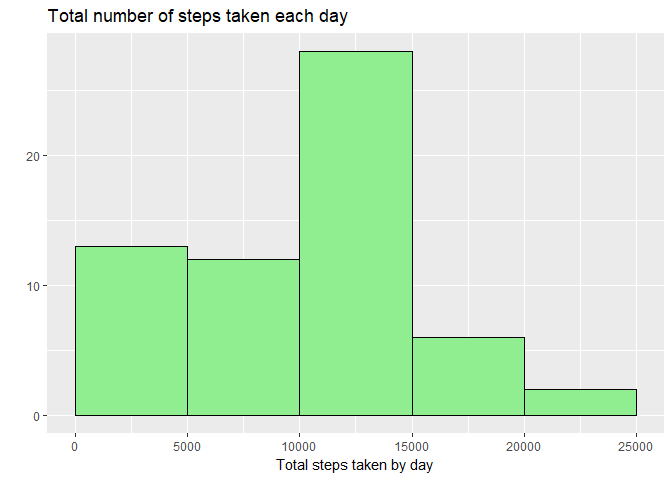
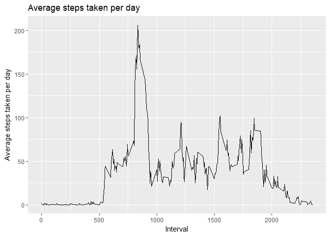
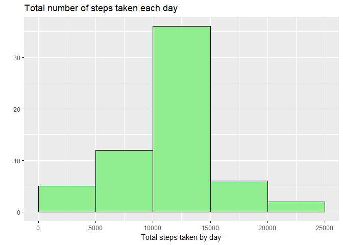
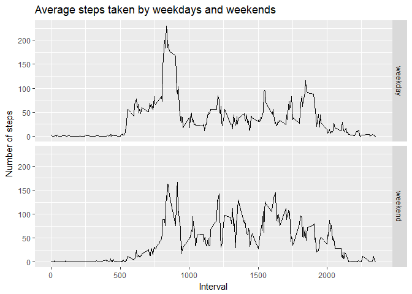

## Loading and preprocessing the data

```r
# Import libraries
library(dplyr)
library(ggplot2)

# Load data
setwd('E:/Cursos/DS JHopkins/5.RR/RepData_PeerAssessment1')
if (!file.exists("activity.csv")) {
  unzip("activity.zip")
}
df <- read.csv("activity.csv")
```

## What is mean total number of steps taken per day?

```r
# group by date and compute total steps by day
total <- df %>%
  group_by(date) %>%
  summarise(totalsteps=sum(steps, na.rm=TRUE))

# Histogram of the total number of steps taken each day
ggplot(total, aes(totalsteps)) + geom_histogram(breaks=seq(0, 25000, by=5000), 
                 col="black", 
                 fill="palegreen2") +
        labs(x="Total steps taken by day", y="", 
             title="Total number of steps taken each day")
```

<!-- -->

#### Average number of steps taken per day

```r
mean(total$totalsteps)
```

```
## [1] 9354.23
```

#### Median number of steps taken per day

```r
median(total$totalsteps, na.rm=TRUE)
```

```
## [1] 10395
```

## What is the average daily activity pattern?

```r
# group by interval and compute mean across all days
daily <- df %>%
  group_by(interval) %>%
  summarise(avg=mean(steps, na.rm=TRUE))
# plot time series
ggplot(daily, aes(x=interval, y=avg)) + geom_line() +
  labs(x="Interval", y="Average steps taken per day",
       title="Average steps taken per day")
```

<!-- -->

#### Interval with maximun number of steps

```r
max.interval <- daily[which.max(x = daily$avg), "interval"]
max.interval
```

```
## # A tibble: 1 x 1
##   interval
##      <int>
## 1      835
```

## Imputing missing values
#### Number of missing values:

```r
missing <- nrow(df[is.na(df$steps),])
missing
```

```
## [1] 2304
```

#### Fill missing values using the average steps for the same interval in a new 
data frame

```r
# Fill NAs
df.filled <- df
df.filled$steps <- ifelse(is.na(df.filled$steps), 
                          daily[match(df.filled$interval, daily$interval),]$avg,
                          df.filled$steps)

# group by date and compute total steps by day
total.filled <- df.filled %>%
  group_by(date) %>%
  summarise(totalsteps=sum(steps, na.rm=TRUE))

# Histogram of the total number of steps taken each day
ggplot(total.filled, aes(totalsteps)) + 
        geom_histogram(breaks=seq(0, 25000, by=5000), 
                       col="black", fill="palegreen2") +
        labs(x="Total steps taken by day", y="", 
             title="Total number of steps taken each day")
```

<!-- -->

#### Average number of steps taken per day

```r
mean(total.filled$totalsteps)
```

```
## [1] 10766.19
```

#### Median number of steps taken per day

```r
median(total.filled$totalsteps, na.rm=TRUE)
```

```
## [1] 10766.19
```
#### Replacing the NAs with the average value of steps for the same interval
#### the histogram changes.  Many values that were in the bin 0 - 5000 are now
#### in the center of the histogram.  Now the median and the mean are the same,
#### whereas in the histogram without NAs replacement, the mean was smaller than
#### the median.

## Are there differences in activity patterns between weekdays and weekends?

```r
# Create a new variable
df.filled <- mutate(df.filled, 
       type=ifelse(weekdays(as.Date(df.filled$date)) %in% c("Saturday", "Sunday"), 
       yes = "weekend", 
       no = "weekday"))
# As factor
df.filled$type <- factor(df.filled$type)

# group by type of day and compute mean across all days
day.type <- df.filled %>%
  group_by(type, interval) %>%
  summarise(avg=mean(steps, na.rm=TRUE))

# plot time series
p <- ggplot(day.type, aes(x=interval, y=avg)) + 
      geom_line() + labs(x="Interval", y="Number of steps",
                         title="Average steps taken by weekdays and weekends")
p + facet_grid(type~.)
```

<!-- -->
